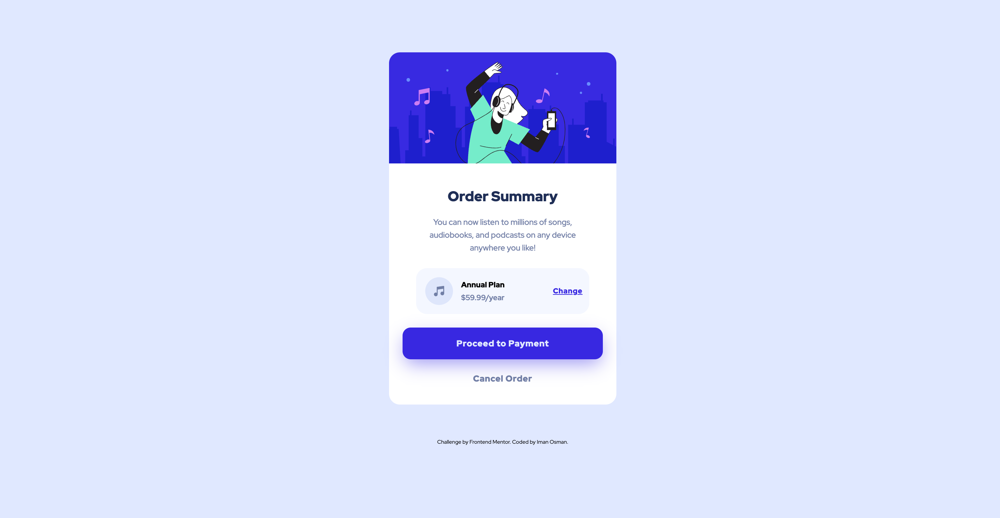

# Frontend Mentor - Order summary card solution

This is a solution to the [Order summary card challenge on Frontend Mentor](https://www.frontendmentor.io/challenges/order-summary-component-QlPmajDUj).

## Table of contents

- [Overview](#overview)
- [Goal](#goal)
- [Outcome](#outcome)
- [My process](#my-process)
- [Built with](#built-with)
- [Feedback](#feedback)
- [Lessons](#lessons)
- [Take forward](#take-forward)
- [Useful resources](#useful-resources)

## Overview

For this challenge, I had to create a static order summary card page. I used it as an opportunity to practice a mobile-first workflow again.

## Goal

My goal with this project is to use Sass as a pre-processor to make my CSS writing more efficient.

## Outcome

:jigsaw: [Live Site URL](https://i000o.github.io/order-summary-component/)  
:pencil2: [Solution URL](https://www.frontendmentor.io/solutions/order-summary-component-with-sass-Gn0iz24H8z)

## Built with

:gear: Semantic HTML5 markup  
:gear: CSS Flex  
:gear: Mobile-first workflow  
:gear: Sass

## My process

:alien: I wrote down my HTML elements that I could see and organised them in an information hierarchy using `<section>`, `<aside>` and other tags.  
:alien: I initiated Sass using the command line with `sass --watch input.scss output.css`.  
:alien: I dug up my CSS reset partial and called on it at the top of the project with `@use 'reset';`. This reset a lot of the default link and list styles.  
:alien: I wrote in some variables with `$` syntax, and started nesting my CSS code in the appropriate places.  
:alien: I began to style the page elements from top to bottom. This went smoothly and quickly for my first session. I got about 60% of the way through in a couple of hours. I feel a lot more confident with this now.  
:alien: When I resumed work the next day, I didn't realise that my Sass wasn't compiling anymore. I assumed it would resume when I opened the workspace but I later found that I had to tick a box for VSCode to do this upon launch. That seemed strange to me, and I still wasn't sure if I was supposed to initiate from the command line everytime. This is still unclear to me. So, I spent an hour or more testing to see whether Sass was compiling or not. I found this frustrating. I also lost some progress locally, which was demoralising but I just redid it.  
:alien: I finished the design, focused on checking my compiler, and writing good Sass. I also introduced a `mixin` with some repeat declarations as well. Other than the compiling issues, I found Sass to be really enjoyable to write. I learnt a lot from comparing the Sass to the CSS output as well. I was glad to use DRY code as it makes the experience more focused and airtight for me.

## Time taken

:alarm_clock: Mobile: 3 hrs  
:alarm_clock: Desktop: 2 hrs

## Feedback

## Lessons

1. Sass - I used mixins, variables, nesting. I'd like to make more modules as I progress.
2. Watch that Sass is compiling regularly. Learn any further commands you might need to initiate it. I've changed my VSCode settings to compile on launch now.
3. I'm faster at media queries now.

## Take forward

:grey_exclamation: Practice more Sass  
:grey_exclamation: I work faster now  
:grey_exclamation: I feel more a lot more confident with HTML & CSS static pages now  
:grey_exclamation: Happy to introduce Sass as a new language I'm using

## Useful resources

[Box shadow generator](https://developer.mozilla.org/en-US/docs/Web/CSS/CSS_backgrounds_and_borders/Box-shadow_generator)

# order-summary-component
